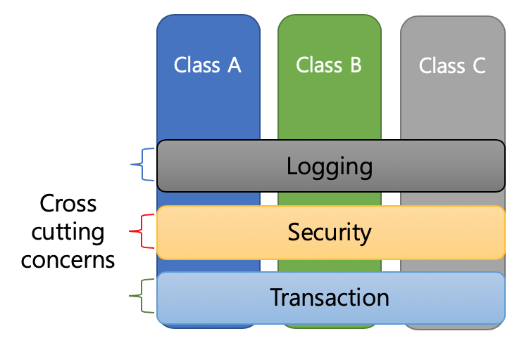

# Spring 공부 정리 Repository

---

## Q 스프링 프레임워크란?
자바 기반의 오픈 소스로 개발자가 비즈니스 로직에 집중할 수 있도록 도움을 주는 프레임워크로 아래와 같은 기능들을 제공해준다.


  - 의존성 주입 (DI)
  - 관점 지향 프로그래밍 (AOP)
  - MVC 패턴
  - 트랜잭션 관리

---

## Q 스프링 컨테이란?
스프링 컨테이너는 애플리케이션의 빈을 생성, 관리하고 의존성을 주입해 주는 역할

스프링 컨테이너는 XML, 자바 설정, yaml or properties, 어노테이션등을 통해 빈을 정의하고 생성 함

스프링 컨테이너는 빈의 생명 주기를 관리하며, 필요한 의존성을 주입 해줌

---

## Q 빈(Bean)이란?
빈은 스프링 컨테이너에 의해 관리되는 객체

---

## Q 의존성 주입 (DI)란?

객체간의 의존 관계를 외부에서 주입하는 것.

스프링에서는 컨테이너가 등록된 빈 객체의 의존성을 관리하고 주입해준다.

아래 코드와 같이 **MyService** 클래스가 **MyRepository**를 사용하고 있다면 **MyService** 클래스가 **MyRepository**를 의존한다고 볼 수 있다.

### 만약 스프링 DI를 사용하지 않는다면?
```java
public class MyService {
    private MyRepository myRepository;

    public MyService() {
        this.myRepository = new MyRepository(); // MyService 가 MyRepository를 생성함. 강한 의존 결합
    }

    public void save() {
        myRepository.saveB();
    }
}

public class MyRepository{
    public void saveB(){
        // .. 저장
    }
}

```
위 코드와 같이  **MyService** 클래스가 **MyRepository**를 생성하게 되고 이는 강한 의존을 하게 된다.

이를 해결하기 위해 총 3가지의 의존성 주입 방법이 있다. 생성자, 세터, 필드 주입(여기서는 생성자 주입만 설명)

### 1. DI 사용

```java

public class MyService {

    private MyRepository myRepository;

    public MyService(MyRepository myRepository) {
        this.myRepository = myRepository; // 생성자로 주입받기만 하고, 외부에서 누군가가 MyRepository 를 생성해줌 (스프링 컨테이너에 등록된 MyRepository Bean을 생성하여 주입함)
    }

    public void save() {
        myRepository.saveB();
    }
}

public class MyRepository {

    public void saveB() {
        // .. 저장
    }
}
```

위 코드를 보면 **MyService** 클래스가 **MyRepository**를 더 이상 생성하지 않고, 생성자로  **MyRepository**를 받기만 함

외부에서 누군가가  **MyRepository** 객체를 만들어줘서 넘겨줘야 함

### 2. DI 사용 
```java
@Configuration
public class AppConfig {

    @Bean
    public MyRepository myRepository() {
        return new MyRepository();
    }

    @Bean
    public MyService myService(MyRepository myRepository) {
        return new MyService(myRepository);
    }
}
```

스프링 컨테이너에 해당  **MyService** 클래스와 **MyRepository**를 Bean로 등록함으로 써 해당 객체의 생명주기를 스프링 컨테이너가 관리하게 된다.

즉 객체의 생성과 주입, 소멸 단계를 스프링 컨테이너가 함으로 써 **IOC**가 된다

또한 MyService 가 MyRepository 를 생성하는게 아니기 때문에 의존성이 약해진다. 이 때 의존성이 없어지는게 아닌 약해지는 것이다.

---

## Q IOC란?

제어의 역전(IOC)은 프로그램의 흐름을 개발자가 아닌 프레임워크가 관리하는 것

이는 객체의 생성과 생명주기 관리를 프레임워크가 담당하게 함으로써, 개발자는 비즈니스 로직에 더 집중할 수 있게 된다.

즉 아래 코드와 같이 스프링의 어노테이션 (@Service,@Component,@Configuration,@Repository... 등) 을 이용하게 되면 해당 클래스가 스프링의 컨테이너 Bean으로 등록되어 해당 객체의 생명중기를 컨테이너가 다루게 된다.

```java
import org.springframework.stereotype.Repository;
import org.springframework.stereotype.Service;

@Service
public class MyService {

    private MyRepository myRepository;

    public MyService(MyRepository myRepository) {
        this.myRepository = myRepository; // 생성자로 주입받기만 하고, 외부에서 누군가가 MyRepository 를 생성해줌 (스프링 컨테이너에 등록된 MyRepository Bean을 생성하여 주입함)
    }

    public void save() {
        myRepository.saveB();
    }
}

@Repository
public class MyRepository {

    public void saveB() {
        // .. 저장
    }
}
```

---

## Q AOP란?
관점 지향 프로그래밍으로, 비즈니스 로직과 공통 관심사를 분리하는 프로그래밍

쉽게 말하자면 어떤 메소드가 실행될 때 해당 메소드가 걸리는 시간을 알기 위해 아래와 같이 코드를 작성할 수 있다.

```java
public void helloMethod() {
    long start = System.currentTimeMillis();
    int a = 1 + 1;
    long end = System.currentTimeMillis();
    long elapsedTime = end - start;
    System.out.println("걸린시간: " + elapsedTime + " ms");
}
```
다른 메소드도 위 코드와 같이 걸리는 시간을 측정하고 싶은데, 그럼 매번 시간 계산을 해야한다. 이 때 이 공통적인 메소드들을 어노테이션이나 모듈로 따로 제작하여 간편하게 사용할 수 있도록 한다.

- 트랜잭션
- 로깅
- 보안

