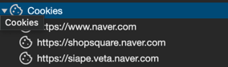

# Spring Security with JWT

## 0. JWT 전 알아야할 개념 (쿠키 & 세션)

> 웹 애플리케이션은 사용자의 대한 정보를 갖고 있어야 한다. 서버에 요청한 사용자를 식별해 해당 사용자의 인증,인가(권한) 을 토대로 보내줄 정보에 대해 허용하거나 거부한다.

### 1. 쿠키

> 쿠키는 서버가 클라이언트에게 보내는 작은 문자열이다.
> 
> 1. 사용자가 서버에 첫 요청을 하면 서버는 문자열 형태로된 쿠키(사용자의 정보가 담김) 를 사용자에게 전송하여 사용자는 해당 쿠키를 웹 브라우저 Storage/Cookies에 저장한다
> 
> 
> 2. 다음 요청부터는 사용자가 서버에서 받은 쿠키를 담아 서버에 보낸다 (Cooke: USER_ID=username1234)
> 하지만 쿠키는 사용자의 정보가 브라우저에 있으므로 쿠키가 탈취되거나 위조될 수 있기 때문에 안전하지 않다.

### 2. 세션
> 쿠키의 문제(사용자의 정보가 사용자 웹 브라우저에 그대로 저장)를 해결하기 위해 나온 방법
> 
> 세션과 쿠키는 서로 다른거같지만 실제로는 그러지 않다. 왜냐하면 세션이 동작하기 위해서는 쿠키가 필요하다.
> 
> 
> 
> 1. 사용자가 서버에 첫 요청을하면 서버는 해당 사용자의 세션 식별자를 생성하여 이를 쿠키로 만들어 사용자한테 이 쿠키를 전송한다.
> [Cookie: MY_SESSION_ID=abcdsasdfa123123123]
> 2. 사용자가 다시 요청을 보내면 해당 쿠키를 보내고, 서버는 요청받은 쿠키의 세션정보를 세션DB에서 찾아 해당 회원의 정보를 토대로 응답을 한다.
> 
> (세션DB)
> Spring Security 를 기준으로 JSESSIONID 라는 이름으로 사용자를 식별함. 이는 spring security context holder 안에 인 메모리 형태로 저장 됨
> 
> 
> 이때 예측 가능한 사용자 ID 대신 추측하기 어려운 임의의 문자열 값을 세션 ID 로 생성해 사용자한테 보낸다.
> 
> 하지만 단점으로는 서버 내에서 메모리저장소에 저장되기 때문에 Scale out 을 하게되면 동기화가 안되는 문제가 있다. 
> 동기화를 위해 따로 메모리 기반 Redis 와 같은 세션 서버를 구성해 세션 동기화를 위한 서버를 두면 되긴하지만, 사용자의 응답속도를 위해 보통 세션 클러스터링 서버는 메모리 기반 서버로 두기 때문에 비용이 만만치 않다.

### 3. 정리 
> 쿠키로 사용자의 정보를 저장하는 것은 보안적으로 취약하고, 세션으로 사용자의 정보를 저장하면 보안상 더 안전하지만, 사용자가 늘어 Scale out 을 하게 된다면 사용자의 Session 을 동기화 해주는 서버를 따로 구성해야 되기 때문에 서버 확장성으로는 좋지 않다.
---
# 1. JWT

### 인증방식 흐름
> 1. 사용자가 첫 로그인을 하면 서버는 사용자의 정보를 담은 페이로드와 서버의 비밀키를 사용하여 서명된 JWT를 생성 
> 2. 이렇게 서명된 토큰은 서버가 토큰을 발행했음을 보증하고, 토큰이 중간에 변조되지 않았음을 보장

### 구조 

- 헤더
    - 토큰의 타입(Bearer token), 사용된 해시 알고리즘(SHA256...)
- 페이로드
  - 토큰에서 사용할 정보(Claim)가 담겨있다
  1. 등록된 Claim : 토큰 정보를 표현하기 위해 이미 정해진 데이터 종류의 데이터들로 선택적으로 작성 할 수 있지만 사용할 것을 권한다
     - iss: 토큰 발급자(issuer)
     - sub: 토큰 제목(subject)
     - aud: 토큰 대상자(audience)
     - exp: 토큰 만료 시간(expiration), NumericDate 형식으로 되어 있어야 함 ex) 1480849147370
     - nbf: 토큰 활성 날짜(not before), 이 날이 지나기 전의 토큰은 활성화되지 않음
     - iat: 토큰 발급 시간(issued at), 토큰 발급 이후의 경과 시간을 알 수 있음
     - jti: JWT 토큰 식별자(JWT ID), 중복 방지를 위해 사용하며, 일회용 토큰(Access Token) 등에 사용
  2. 공개 Claim
     - 사용자 정의 클레임으로, 공개용 정보를 위해 사용된다. 충돌 방지를 위해 URI 포맷을 이용
       ("http://hello.com" : true)
  3. 비공개 Claim
     - 비공개 클레임은 사용자 정의 클레임으로, 서버와 클라이언트 사이에 임의로 지정한 정보를 저장
       ("token_type" : access)
- 서명
  -  토큰을 인코딩하거나 유효성 검증을 할 때 사용하는 고유한 암호화 코드
    - 서명(Signature)은 위에서 만든 헤더(Header)와 페이로드(Payload)의 값을 각각 BASE64Url로 인코딩하고, 인코딩한 값을 비밀 키를 이용해 헤더(Header)에서 정의한 알고리즘으로 해싱을 하고, 이 값을 다시 BASE64Url로 인코딩하여 생성

> 즉 서버는 사용자의 요청을 서버에 저장하지 않는다.(클라이언트의 정보를 토대로 토큰을 생성해 사용자한테 전송. 서버는 토큰 검증만함)
### 장점
> 서버는 사용자의 정보를 서버에 저장하지 않는다
> 
> 즉 사용자 요청마다 서버 세션DB 조회할 필요가 없다.
> 또한 서버가 늘어나도 토큰 만료,변조만 검증하면 되기 때문에 서버 확장에 용이하다.

### 단점
1. 설정을 잘못할 경우 누구나 유효한 JWT 토큰을 생성하여 다른 사람인 것처럼 요청 가능
2. 로그아웃 문제!!
   -  세션에서는 세션 토큰을 서버에서 제거하기만 하면 세션을 "무효화" 할 수 있지만 JWT 는 서버가 클라이언트의 정보를 저장하지 않는 stateless 형태기 때문에 불가능
   > 로그아웃 문제 해결법
   >
   > 1. 토큰 만료시간을 짧게 설정 (하지만 리프레시 토큰 사용해야 함)
   > 2. 클라이언트가 서버에 액세스 토큰을 보냈는데 만료된 토큰이라 요청을 받으면 클라이언트 쪽에서 토큰 삭제
   > 3. 최근에 만료된 토큰 목록이 있는 테이블 생성
   > 
   > (사용자가 로그아웃을 요청하면 리프레시 토큰을 블랙리스트로 메모리기반 DB 에 저장하여 해당토큰 인증 거부 https://engineerinsight.tistory.com/232, https://evertpot.com/jwt-is-a-bad-default/) 
