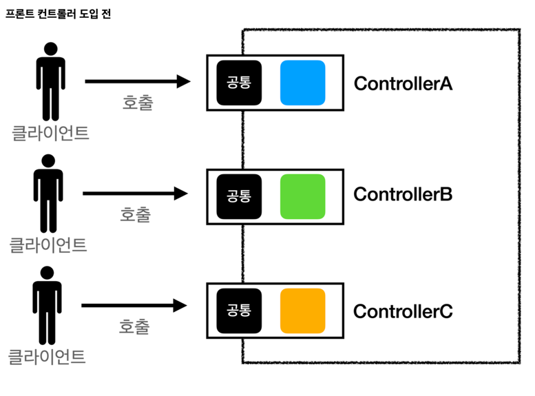
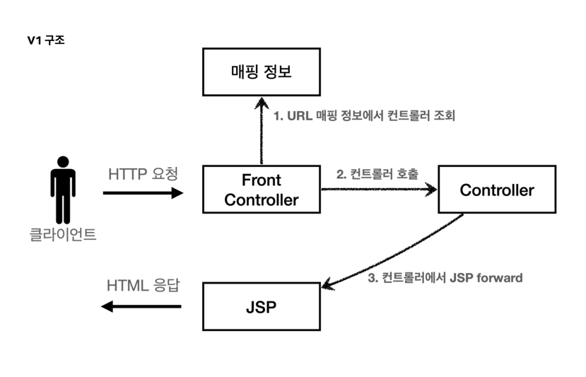

# Spring FrameWork 직접 만들어 보기

## 1. FrontController 도입 전


## 2. FrontController 도입 후


---
## V1 


- 절대 경로 /front-controller/v1/*
- members/new-form -> new MemberFormControllerV1() 맵핑
- members/save -> new MemberSaveControllerV1() 맵핑
- members -> new MemberListControllerV1() 맵핑
```java
@WebServlet(name = "frontControllerServletV1", urlPatterns = "/front-controller/v1/*")
public class FrontControllerServletV1 extends HttpServlet {

    private Map<String, ControllerV1> controllerV1Map = new ConcurrentHashMap<>();

    public FrontControllerServletV1() {
        controllerV1Map.put("/front-controller/v1/members/new-form", new MemberFormControllerV1());
        controllerV1Map.put("/front-controller/v1/members/save", new MemberSaveControllerV1());
        controllerV1Map.put("/front-controller/v1/members", new MemberListControllerV1());
    }

    @Override
    protected void service(HttpServletRequest request, HttpServletResponse response)
        throws ServletException, IOException {
        System.out.println("FrontControllerServletV1.service");

        String requestURI = request.getRequestURI();

        // /front-controller/v1/members/new-form -> new MemberFormControllerV1()
        ControllerV1 controller = controllerV1Map.get(requestURI);

        if (controller == null) {
            response.setStatus(HttpServletResponse.SC_NOT_FOUND);
            return;
        }

        controller.process(request, response);

    }

}
```

---
## V2


- controller 가 jsp 를 직접 return 하지 않는다.

---