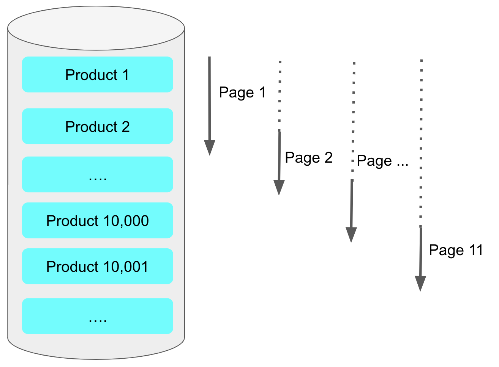

# 페이징 성능 개선하기 - No Offset

## 1-1. No Offset은 왜 빠른가?

기존에 사용하는 페이징 쿼리는 다음과 같은 형태다.

- 최신 -> 과거순으로 정렬한다는 기준
```sql
SELECT *
FROM items
WHERE 조건문
ORDER BY id DESC
OFFSET 페이지번호
LIMIT 페이지사이즈
```

| 최신 -> 과거순으로 정렬을 하면 페이징 쿼리는 뒤로 갈수록 앞에서 읽었던 행을 다시 읽어야 한다.



예를들어 offset 10000, limit20 이라하면 최동적으로 10,020개의 행을 읽어야 한다.
(10,000 부터 20개를 읽어야 함)

심지어 앞의 10,000개의 행을 버리게 된다. 10,001 번부터 10,020까지의 데이터가 필요하니까

뒤로 갈수록 버리지만 읽어야 할 행의 개수가 많아 점점 뒤로 갈수록 느려지는 것이다.

No Offset 방식은 바로 이 부분에서 조회 시작 부분을 인덱스로 빠르게 찾아 매번 첫 페이지만 읽도록 하는 방식이다.

```sql
SELECT *
FROM items
WHERE 조건문
AND id < 마지막 조회 ID # 직전 조회 결과의 마지막 id
LIMIT 페이지 사이즈
```
이전에 조회된 결과를 한번에 건너뛸 수 있게 마지막 조회 결과의 ID를 조건문에 사용하는 것으로 이는 매번 이전 페이지 전체를 검색할 필요가 없다.

즉, 아무리 페이지가 뒤로 가더라도 처음 페이지를 읽은 것과 동일한 성능을 가지게 된다.