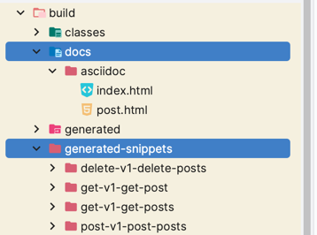
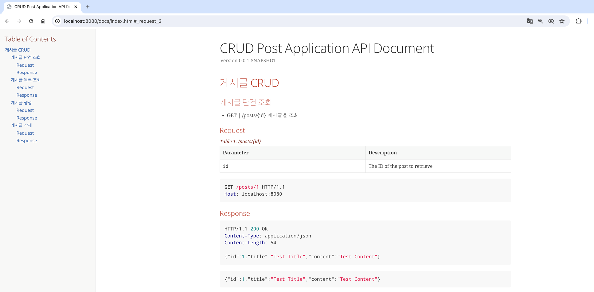

# RestDocs Simple API 


## 1. build.gradle

```groovy
plugins {
    id 'java'
    id 'org.springframework.boot' version '3.2.1'
    id 'io.spring.dependency-management' version '1.1.4'
    id 'org.asciidoctor.jvm.convert' version '3.3.2' 
}

group = 'com.example'
version = '0.0.1-SNAPSHOT'

java {
    sourceCompatibility = '17'
}

configurations {
    compileOnly {
        extendsFrom annotationProcessor
    }
    asciidoctorExt // asciidoctorExt에 대한 선언
}

repositories {
    mavenCentral()
}


dependencies {
    
    // ....
    asciidoctorExt 'org.springframework.restdocs:spring-restdocs-asciidoctor' // asciidoctorExt에 spring-restdocs-asciidoctor 의존성 추가
    testImplementation 'org.springframework.restdocs:spring-restdocs-mockmvc' // mockMvc 사용
}

// 1. 스니펫이 생성되는 디렉터리 경로를 설정합니다.
// Spring REST Docs가 생성하는 스니펫들을 저장하는 곳(*-request.docs / *-response.docs)
ext {
    snippetsDir = file('build/generated-snippets')
}

// 2. 'test' 태스크를 설정
// 'outputs.dir snippetsDir'는 JUnit 테스트 중에 생성되는 스니펫을 스니펫 디렉터리에 저장하도록 지정
tasks.named('test') {
    outputs.dir snippetsDir
    useJUnitPlatform()
}

// 3. 'asciidoctor' 태스크를 설정
// 'configurations'는 asciidoctor 확장을 사용할 때 필요한 의존성들을 포함
// 'baseDirFollowsSourceFile'는 asciidoctor가 .adoc 파일에서 다른 파일을 include할 때 사용하는 설정 (index.adoc(post.adoc))
// 'inputs.dir snippetsDir'는 asciidoctor가 스니펫을 찾을 위치를 설정
// 'dependsOn test'는 asciidoctor 태스크가 'test' 태스크 이후에 실행되어야 함
tasks.named('asciidoctor') {
    configurations 'asciidoctorExt'
    baseDirFollowsSourceFile()
    inputs.dir snippetsDir
    dependsOn test
}

// 4. 'asciidoctor' 태스크 실행 전에 수행될 작업을 정의
// 'delete' 는 문서를 생성하기 전에 'src/main/resources/static/docs' 디렉터리를 삭제
asciidoctor.doFirst {
    delete file('src/main/resources/static/docs')
}

// 5. 'copyDocument' 태스크를 등록
// 'from'은 asciidoctor에 의해 생성된 HTML 파일들이 있는 디렉터리를 지정
// 'into'는 HTML 파일들이 복사될 최종 위치를 지정 (build/docs/asciidoc -> src/main/resources/static/docs)
tasks.register('copyDocument', Copy) {
    dependsOn asciidoctor
    from file("${asciidoctor.outputDir}")
    into file("src/main/resources/static/docs")
}

// 6. 'build' 태스크를 설정
// 'dependsOn copyDocument'는 빌드 프로세스가 'copyDocument' 태스크에 의존한다는 것을 의미
// 이는 빌드 시 'copyDocument' 태스크가 실행되어 문서를 복사하도록 함
build {
    dependsOn copyDocument
}


// 7. 'bootJar' 태스크를 설정
// 이 태스크는 JAR 파일을 생성하는 태스크
// 'from' 절은 asciidoctor에 의해 생성된 HTML 파일들이 있는 디렉터리를 지정하고,
// 'into' 절은 JAR 파일 내부의 'static/docs'로 파일을 복사
bootJar {
    dependsOn asciidoctor
    from ("${asciidoctor.outputDir}") {
        into 'static/docs'
    }
}

```

## 2. Entity,Controller,Service,Repository
```java
// Entity
@NoArgsConstructor
@AllArgsConstructor
@Data
@Entity
public class Post {
    @Id
    @GeneratedValue(strategy = GenerationType.IDENTITY)
    private Long id;
    private String title;
    private String content;
}

// Controller
@RequiredArgsConstructor
@RequestMapping("/posts")
@RestController
public class PostController {
    private final PostService postService;

    @PostMapping
    public ResponseEntity<Post> createPost(@RequestBody Post post) {
        Post savedPost = postService.save(post);
        return ResponseEntity.status(HttpStatus.CREATED).body(savedPost);
    }

    @GetMapping("/{id}")
    public ResponseEntity<Post> getPost(@PathVariable Long id) {
        Post post = postService.findById(id);
        return ResponseEntity.ok(post);
    }

    @DeleteMapping("/{id}")
    public ResponseEntity<Void> deletePost(@PathVariable Long id) {
        postService.deleteById(id);
        return ResponseEntity.status(HttpStatus.NO_CONTENT).build();
    }

    @GetMapping
    public ResponseEntity<List<Post>> getAllPosts() {
        List<Post> posts = postService.findAll();
        return ResponseEntity.ok(posts);
    }
}

// Repository
public interface PostRepository extends JpaRepository<Post,Long> {

}

// Service
@RequiredArgsConstructor
@Service
public class PostService {

    private final PostRepository postRepository;

    public Post save(Post post) {
        return postRepository.save(post);
    }

    public Post findById(Long id) {
        return postRepository.findById(id).orElseThrow();
    }

    public void deleteById(Long id) {
        postRepository.deleteById(id);
    }

    public List<Post> findAll() {
        return postRepository.findAll();
    }
}
```

## TestCode with RestDocs
```java
@WebMvcTest(PostController.class)
@AutoConfigureRestDocs
class PostControllerTest {

    @Autowired
    private MockMvc mockMvc;

    @MockBean
    private PostService postService;
    private final String uri = "/posts";


    @Test
    @DisplayName("게시글 저장")
    void test01() throws Exception {
        Post mockPost = new Post();
        mockPost.setId(1L);
        mockPost.setTitle("Test Title");
        mockPost.setContent("Test Content");

        Mockito.when(postService.save(Mockito.any(Post.class))).thenReturn(mockPost);

        mockMvc.perform(post(uri)
                .contentType(MediaType.APPLICATION_JSON)
                .content(new ObjectMapper().writeValueAsString(mockPost)))
            .andExpect(status().isCreated())
            .andDo(print())
            .andDo(document("post-v1-post-posts",
                requestFields(
                    fieldWithPath("id").description("The ID of the post"),
                    fieldWithPath("title").description("The title of the post"),
                    fieldWithPath("content").description("The content of the post")
                ),
                responseFields(
                    fieldWithPath("id").description("The ID of the created post"),
                    fieldWithPath("title").description("The title of the created post"),
                    fieldWithPath("content").description("The content of the created post")
                )
            ));
    }

    @Test
    @DisplayName("게시글 조회")
    void test02() throws Exception {
        Long postId = 1L;
        Post post = new Post();
        post.setId(postId);
        post.setTitle("Test Title");
        post.setContent("Test Content");


        Mockito.when(postService.findById(postId)).thenReturn(post);

        mockMvc.perform(get(uri + "/{id}", postId))
            .andExpect(status().isOk())
            .andDo(document("get-v1-get-post",
                pathParameters(
                    parameterWithName("id").description("The ID of the post to retrieve")
                ),
                responseFields(
                    fieldWithPath("id").description("The ID of the retrieved post"),
                    fieldWithPath("title").description("The title of the retrieved post"),
                    fieldWithPath("content").description("The content of the retrieved post")
                )
            ));

    }

    @Test
    @DisplayName("게시글 삭제")
    void test03() throws Exception{
        Long postId = 1L;
        Mockito.doNothing().when(postService).deleteById(1L);

        mockMvc.perform(delete(uri+"/{id}",postId))
            .andExpect(status().isNoContent())
            .andDo(print())
            .andDo(document("delete-v1-delete-posts",
                pathParameters(
                    parameterWithName("id").description("The ID of the post to delete")
                )
            ));
    }

    @DisplayName("모든 게시글 조회")
    @Test
    void test04() throws Exception {
        List<Post> posts = Arrays.asList(
            new Post(1L, "title1", "content1"),
            new Post(2L, "title2", "content2")
        );

        Mockito.when(postService.findAll()).thenReturn(posts);

        mockMvc.perform(get(uri))
            .andExpect(status().isOk())
            .andDo(print())
            .andDo(document("get-v1-get-posts",
                responseFields(
                    fieldWithPath("[].id").description("The ID of the post"),
                    fieldWithPath("[].title").description("The title of the post"),
                    fieldWithPath("[].content").description("The content of the post")
                )
            ));
    }
}
```

### 문서 작성
- /build/generated-snippets
> 테스트코드를 성공적으로 완료하면 docs,generated-snippets 가 생성 됨
> 
> 
> src/docs/asciidoc 폴더 생성
> 
> index.adoc 파일 생성 후 문서 작성
> 
> 가독성을 위해 include::post.adoc[] 으로 index.adoc 파일이 post.adoc 파일을 불러오도록 설정
> 
> [index.adoc](src%2Fdocs%2Fasciidoc%2Findex.adoc)
> 
> [post.adoc](src%2Fdocs%2Fasciidoc%2Fpost.adoc)


### 결과
> gradle build
> 
> 
> localhost:8080/index.adoc 접속
> 