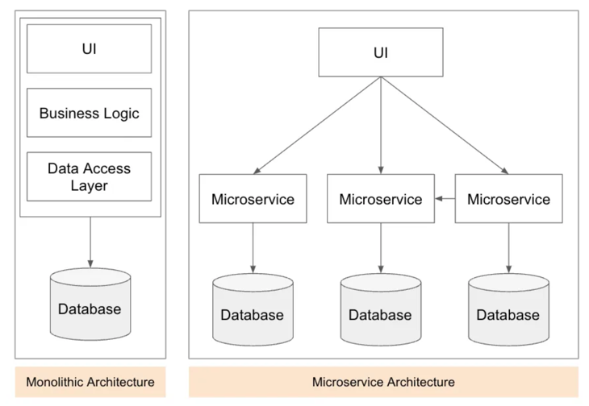
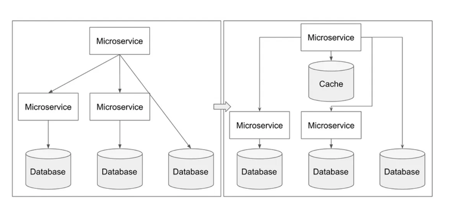

# SpringBoot 와 Redis 로 캐싱 구현하기

---

## 캐싱이란?
- 캐싱은 데이터 처리 비용을 줄이기 위해 사용되는 기법
  - 비용이 많이 드는 데이터 조회 작업에서 자주 사용

---

### 캐시 개요
> 이전에 처리(검색/계산) 되었던 데이터를 효과적으로 재사용하는 기법.
> 일반적으로 기본 데이터 처리 방법보다 속도가 빠른 고속 데이터 계층을 두고, 동일한 요청에 대해서는 해당 계층을 통해 빠른 속도를 보장

---




### 모놀리틱 VS MSA

모놀리틱에서 MSA 의 전환, 클라우드 환경의 전환으로 모든 단위별 기능과 데이터 들이 서비스 내부에서 관리되고 제공 된다. 서비스별 통신 방법은 협의된 방법을 통해 내/외부 통신을 하게 된다

하지만 네트워크로 통신을 주고받는 과정은 비용이 드는 문제이며, 가끔은 지연이 발생하거나 유실이 발생 할 수 있다. 내부 스토어에 접근하더라도 원본 데이터의 양 증가와 구조의 복잡함에 따라 속도 저하 등의 문제가 발생 할 수 있다.

이런 경우 네트워크나 내부 스토리지를 통해 자주 가져오는 데이터를 미리 조회하여 스토리지나 네트워크를 통해 가져오는 것보다 빠른 계층에 데이터를 임시 저장하여 데이터의 변경이 있을 때 까지 그 데이터만을 사용하는 기법

---

### 캐시를 적용한 MSA



이렇게 임시 저장하여 사용하는 데이터를 통해 스토리지나 네트워크 통신 시 발생 할 수 있는 지연 유실을 줄이고 데이터 처리에 필요한 속도 저하를 낮출 수 있게 된다.
또한 여러 데이터를 조합해서 결과를 제공하는 경우 미리 결과를 조합하여 캐싱 처리를 해둔다면 불필요한 엑세스를 위한 대기 시간을 줄이고 응답을 처리 할 수 있다.

#### 자주 액세스 하는 데이터를 캐싱함으로써 액세스 하는 횟수를 줄여 성능을 향상 및 안전성 향상

---

## 캐시 사용 사례
#### CPU 
 - CPU 에서도 자주 사용되는 정보들에 대해 Multi Level Cache 지원

#### HTTP
- 동일한 API 요청에 대해 반복적으로 요청ㅇ하지 않도록 클라이언트에서 요청별 키를 관리하여 캐싱


---

## 캐시 적중률

#### 캐시의 취지와 상황을 고려했을 때 모든 데이터를 캐싱 처리 할 수 없기 때문에 서비스 영역에서 우선순위 정의가 필요하다.

예)
- 데이터 회 요청을 위한 비용이 큰 경우
- 동일한 데이터 요청이 많은 경우
  - 캐시 요청 기준에서의 동일한 요청을 의미 즉 애플리케이션인 캐시 데이터에 접근을 자주 한다는 의미이며 이는 캐싱을 효과적으로 사용한다는 것을 의미


---

## 캐시 성능 측정

- Cache Hit(캐시 적중) : 캐시에 데이터가 이미 존재하여 캐시를 통해 데이터 제공을 수행한 경우
- Cache Miss(캐시 누락) : 접근하려는 데이터가 캐싱되어 있지 않은 상태 이런경우 DB 조회 함
- Cache Hit Rate(캐시 적중률) : 데이터를 캐시로 제공을 수행한 비율
- Cache Hit Ratio = Cache Hits Count / (Cache Hits Count + Cache Misses Count)

> 이상적인 캐시 성능을 위해서는 높은 Hit Ratio, 낮은 Miss Ratio (이는 캐시가 데이터를 효율적으로 저장하고 조회하여 반복적으로 요청을 빠르게 처리 할 수 있다는것을 의미)

---

## 캐시 만료(Cache Expire)

캐시는 저장공간이 적기 때문에 무기한으로 데이터를 저장하면 안된다. 
- 특정 API에 회원 정ㅈ보가 캐싱되어있을 때, 해당 회원이 장기간 사용하지 않는다고 가정하면 해당 고객의 캐싱 정보 만료시간을 고민해야 된다

> Redis의 경우 이런 만료시간을 처리하기 위해 key별 TTL(Time-To-Live)을 설정 할 수 있다.

```redis
> set username::1 'minwoo' EX60 #1
> TTL username::1               #2
(integer) 60

> set username::2 'kim' EX60    #3
> TTL username::2               #4
(integer) -1
```
1. set 명령어로 String 형태의 데이터 저장하고 만료 시간을 60초로 설정
2. TTL 명령어로 특정 키의 만료 시간 조회 (60초)
3. set 명령어로 String 형태의 데이터 로 저장하고 만료 시간 미지정(무기한)
4. TTL 명령어로 특정 키의 만료 시간 조회 (-1/만료 없음)

--- 

## 캐싱 관리

### KEY
- 요청에 대한 식별자료, KEY를 통해 조회/저장/삭제 처리 가능

### VALUE
- 캐싱 처리할 데이터
- 캐싱되어 사용하는 데이터 값의 변경이 있을 때 변경에 대한 갱신 관리 필요
- 캐싱 처리 이후 필드의 기준이 변경되거나 신규 필드가 추가 됐을 때 갱신 관리 필요


### EXPIRE
- KEY별로 적절한 TTL 을 사용하여 불필요 데이터 삭제 필요

---

## 추가 고려 항목

### 원본 스토리지, 캐시 데이터 불일치 케이스
> 다른 서비스에서 캐싱되어 사용하는 데이터 중 변경 사항이 있는 경우, 이를 캐싱하여 사용하고 있는 부분이 동기화가 되어야한다. 
> 변경이 많지 않은 데이터가 캐싱하기 쉬운 데이터라고 볼 수 있다.

### 데이터 용량
- 미사용 되는 데이터에 대해 처리
- 캐싱 처리했을 때의 이점이 있는 데이터인지 고려 필요
- 데이터 관리를 위해 적재될 데이터의 사이즈 고려 필요
- Redis 에서는 MEMORY USAGE {KEY} 해당 키를 기반으로 하나의 키에 대한 메모리 사용 byte 를 확인 할 수 있음

```redis
> MEMORY USAGE username::2
(integer) 72
```

--- 

# Redis Getting Started In SpringBoot

### Jetty

- build.gradle


```groovy
	implementation 'org.springframework.boot:spring-boot-starter-data-redis'
```
